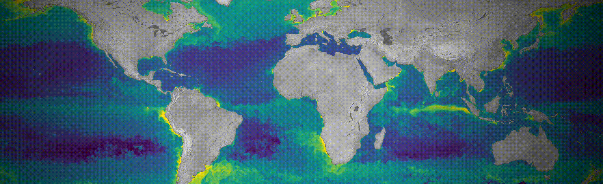

<b>C O A S T Y</b>

**Coasty** is a Python package for coastal oxygen data analysis and visualization. It provides tools for processing, analyzing, and visualizing coastal oxygen data, with a focus on reproducibility and ease of use.

<b>I N S T A L L A T I O N</b>

Install **coasty** with all optional dependencies:

    conda create -n coasty python=3.11
    conda activate coasty

Then, install the package and its dependencies:

    pip install --editable '.[all]'

Optionally, install the pre-commit hooks to automatically detect code issues before each commit:

    pre-commit install --config pre-commit.yml
